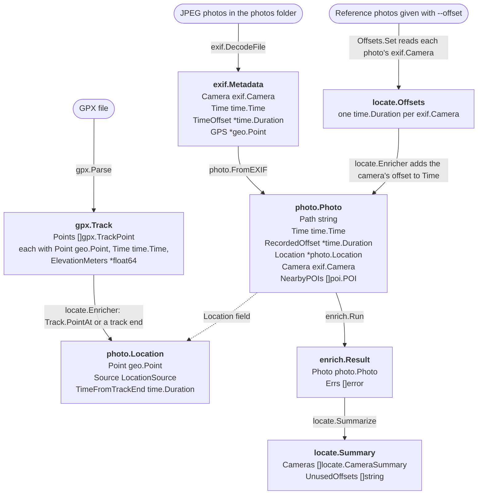

# retrace

Go tool that locates hike photos along a GPX track using EXIF GPS and timestamp interpolation, then tags them with nearby OpenStreetMap landmarks. Generates a self-contained HTML map with a photo flythrough for revisiting or sharing viewpoints.

## Install

Requires Go 1.27.1+.

```sh
go install github.com/sh531/retrace/cmd/retrace@latest
```

Or from a local clone:

```sh
git clone https://github.com/sh531/retrace.git
cd retrace
go install ./cmd/retrace
```

Both install `retrace` to `$(go env GOPATH)/bin` (usually `~/go/bin`), which needs to be on your `PATH`.

## Usage

> The CLI is still being built; commands and flags may change.

retrace takes a folder of JPEG photos and a GPX track (with timestamps) recorded on the same hike. Export HEIC and RAW photos as JPEG first, since browsers can't display RAW and most can't display HEIC. retrace reads the files directly inside the folder, not its subfolders.

### Finding your camera's offset

If the photos have no GPS, retrace places them on the track by time. It converts each photo's `DateTimeOriginal` to UTC using the timezone the camera recorded in `OffsetTimeOriginal`. If the camera recorded no timezone, retrace assumes the time is already UTC. The flag `--offset photo=duration` then adds a correction for the camera that took the `photo`, e.g. `--offset DSC00042.jpg=2m30s`: every photo with the same EXIF `Make` and `Model` as DSC00042.jpg gets 2m30s added. Use the clock photo from the steps below, or any other photo from that camera. Repeat the flag once per camera. If you don't add an offset for a camera, there will be no correction. Photos taken by a phone won't need an offset correction since their clocks set themselves.

How to determine the --offset duration:

1. With the camera, take a photo of your phone's clock.
2. Read the camera's time and timezone from that photo: `exiftool -DateTimeOriginal -OffsetTimeOriginal photo.jpg`.
3. Convert both times to UTC, then subtract:
  ```
   offset = phone time in UTC − camera time in UTC
  ```
   For the camera's time in UTC: if it recorded a timezone, convert using that timezone (`-07:00` means 7 hours behind UTC, so add 7 hours). If it recorded no timezone, retrace assumes the time is already UTC, so use it unchanged.
   For example, the phone shows 08:00:00 PDT, which is 15:00:00 UTC:

  | Camera recorded        | Camera time in UTC | phone time in UTC 15:00:00 − camera time in UTC        |
  | ---------------------- | ------------------ | ------------------------------------------------------ |
  | 07:57:30 with `-07:00` | 14:57:30           | `--offset photo.jpg=2m30s` (camera is behind phone)    |
  | 08:07:30, no timezone  | 08:07:30           | `--offset photo.jpg=6h52m30s`                          |
  | 08:01:15 with `-07:00` | 15:01:15           | `--offset photo.jpg=-1m15s` (camera is ahead of phone) |

   Shortcut: if the camera recorded the same timezone the phone shows, just subtract the two clock times: 08:00:00 − 07:57:30 = 2m30s.

The same offset works for every photo until you change or reset the camera's clock.

## How the data fits together

A few small types carry all of retrace's data. Packages share them instead of converting between their own versions, so a track point's position can become a photo's location as it is.



Rounded boxes are retrace's inputs and the other boxes are structs. Each solid arrow is labelled with the function that writes the struct it points to; the dotted arrow is a field. How photos pass through the enrichers is described under [Enrichment](#enrichment).

- `geo.Point` (`Lat`, `Lon`) is the only coordinate type. Track points, EXIF GPS, and photo locations all use it, so `locate` copies a `gpx.TrackPoint`'s `Point` straight into a `photo.Location`.
- `time.Time` is always UTC. `exif` converts camera time when it reads it and `gpx` converts track time when it parses it, so `locate` compares a photo's `Time` with track times directly.
- `exif.Camera` (`Make`, `Model`) identifies a camera. It's a struct of two strings, so it can be compared with `==` and used as a map key: `locate.Offsets` stores one offset per `exif.Camera`, and `locate.Summarize` groups photos by it.
- `photo.Photo` is everything retrace knows about one photo. `photo.FromEXIF` builds it from `exif.Metadata`, renaming `TimeOffset` to `RecordedOffset` so it isn't mistaken for the `--offset` correction. Each enricher takes one and returns an updated copy. Unknown values stay empty instead of using a default that looks real: a zero `Time`, a `nil` `Location`.
- `photo.Location` (`Point`, `Source`, `TimeFromTrackEnd`) records where a photo was taken and how that was figured out: `exif`, `interpolated`, or `track_end`. `TimeFromTrackEnd` says how far a `track_end` photo was from the track.
- `enrich.Result` pairs each finished `photo.Photo` with the errors from enrichers that failed on it, so one bad photo is reported without stopping the run.

## Design decisions

### Time

**Camera time is a fixed offset per device.**

- EXIF `DateTimeOriginal` has no timezone. Phones record theirs in `OffsetTimeOriginal`, and many cameras record the zone they were set to.
- A camera clock that is never adjusted doesn't follow travel or daylight saving, and it drifts.
- retrace converts `DateTimeOriginal` to UTC using the recorded timezone (`OffsetTimeOriginal`), or assumes it is already UTC if there is none. It then adds the `--offset` given for the photo's camera, covering both a wrong zone and drift. See [Finding your camera's offset](#finding-your-cameras-offset).

**A camera is identified by a photo it took, not by name.**

- `--offset DSC00042.jpg=2m30s` applies to every photo with exactly the same EXIF `Make` and `Model` as DSC00042.jpg. Typing a camera name instead would mean guessing which EXIF strings it stands for: makes can be company names (`NIKON CORPORATION`, `OLYMPUS CORPORATION`), models can repeat the make (`NIKON D850`) or differ from the marketing name (a Sony A9 reports `ILCE-9`). Using the EXIF of the offset photo to compare simplifies the logic. 
- There's one offset per camera model (EXIF `Make` and `Model`), since each camera's clock drifts on its own. Two bodies of the same model look the same; telling them apart would mean also matching the EXIF `BodySerialNumber`, which retrace doesn't read: it's a rare case, and exported photos often leave the serial out.
- A reference photo with neither `Make` nor `Model` is rejected, since it would match every photo with stripped metadata, from any camera.
- retrace reports reference photos whose camera took none of the photos, which usually means the wrong file was given.

**Times are stored in UTC.**

- The recorded offset is only used to work out UTC, so JSON times always end in `Z`.
- `==` on `time.Time` compares the zone as well as the instant, so with one zone a stray `==` can't give a wrong answer.
- An unknown time is the zero `time.Time`, not a `nil` pointer, following Go convention: year 1 is never a real photo time.

### Location

**A photo's location is optional and all-or-nothing.**

- `Photo.Location` is a `*Location` holding the point and how it was determined (`exif`, `interpolated`, or `track_end`), or `nil` when the photo couldn't be located.
- Grouping them means a point can't exist without a source, or vice versa.u
- `nil` keeps the zero value (0,0), a real place in the Atlantic, from being plotted by mistake.

**EXIF GPS first, then the track.**

- A photo with EXIF GPS keeps it, since the camera's own fix is more accurate than a position worked out from its clock. Otherwise retrace interpolates along the track: it finds the track points recorded just before and after the photo's corrected time and places the photo the same fraction of the way between them, in a straight line. Points are usually a few seconds apart (about 5 s in an AllTrails track, 1 s in a Strava one), so the straight line between two of them stays close to the trail.
- A photo taken before the track starts or after it ends is placed at the track's nearest end, with source `track_end` and the time between the photo and that point (`TimeFromTrackEnd`), negative before the start and positive after the end. A recording often stops before the photos do (stopped early, or the phone died), and the end of the track is the best guess. The map can show these pins differently and say how far off they are. retrace reports how many per camera and the longest gap, since many photos at the ends, hours away, means the camera's `--offset` is wrong.
- A gap inside the track (e.g. the recording paused during a break) is bridged with a straight line, so photos taken during it may be placed off the trail.
- A photo with no time stays unlocated: adding the `--offset` to a zero time would turn "unknown" into a fake time.

**Some GPS values mean "no fix".**

- A position with `GPSStatus` V ("void") or at exactly (0,0) is treated as missing.
- (0,0) is a real place, but no hike goes there, and some devices write zeros when they have no fix.

### GPX tracks

**Track points need a time; elevation is optional.**

- Time is what places a photo on the track, so a point without `<time>` fails parsing. The usual cause is exporting a trail's planned route instead of a recorded activity.
- Elevation is `*float64` and `nil` when `<ele>` is missing, because 0 m is sea level: a zero default would draw a fake drop in the elevation profile. NaN isn't used because `encoding/json` can't encode it.

### Photos and EXIF

**JPEG only.**

- The page has to display the photos, and browsers can't show RAW and mostly can't show HEIC, so they have to be exported as JPEG anyway.
- HEIC wraps the same TIFF-format EXIF block, so supporting it later means finding that block in a different container.

**A hand-written EXIF reader.**

- `internal/exif` reads just the [tags](https://exiftool.org/TagNames/EXIF.html) retrace uses, with the standard library (`encoding/binary`).
- Considered: [rwcarlsen/goexif](https://github.com/rwcarlsen/goexif) (last commit April 2019), [dsoprea/go-exif](https://github.com/dsoprea/go-exif) (last commit August 2023), and [evanoberholster/imagemeta](https://github.com/evanoberholster/imagemeta), which is maintained but brings 7 direct dependencies and support for RAW and HEIC formats retrace doesn't accept. exiftool was ruled out as a runtime dependency because it's an extra install for every user.
- retrace needs 19 tags from JPEG files, a few hundred lines of standard-library code that can be fuzzed and fully tested, which is less to audit than a dependency tree.
- The reader checks every offset against the data before following it, and a fuzz test (`FuzzDecode`) checks that malformed files never cause a panic or out-of-range values.
- How EXIF is laid out inside a JPEG (segments, the TIFF header, image file directories) is explained in the package docs: `[internal/exif/doc.go](internal/exif/doc.go)`, or run `go doc ./internal/exif`.
- exiftool is only used to regenerate the test fixtures, as an independent EXIF writer to check the reader against. Running retrace or its tests doesn't need it.

### Enrichment

**Each photo passes through a list of enrichers; photos are processed in parallel.**

- An enricher (`enrich.Enricher`) takes a photo and returns an updated copy: reading EXIF first, then location, then (planned) nearby landmarks. They run in order for each photo, since landmarks need the location.
- One enricher failing doesn't stop the others: its result is discarded, the error is kept with the photo, and the next enricher gets the photo unchanged. So a photo with malformed EXIF is kept, unlocated, with a warning: one bad photo out of 500 shouldn't ruin the run, though a bad GPX file still does.
- Enrichers take and return a photo value rather than a pointer. If an enricher fails, its returned photo is ignored and the next enricher gets the photo from before. That's only safe if the failed enricher changed nothing but its own copy, and the copy is shallow: `Location` and `NearbyPOIs` point at the same data in both the original and returned photos. So enrichers must assign new values to those fields instead of modifying them.
- Concurrency uses [errgroup](https://pkg.go.dev/golang.org/x/sync/errgroup) from the Go team's `golang.org/x/sync`, whose `SetLimit` caps how many photos are processed at once. Each goroutine writes only its own element of the results slice, so no mutex or channel is needed and results stay in input order.
- No lock is needed because nothing is shared: the Go [memory model](https://go.dev/ref/mem) only calls it a data race when goroutines access the same memory location, and each goroutine writes a different element. Reading the results after `Wait` is safe because a `sync.WaitGroup`'s `Done` "synchronizes before" `Wait` returns. This is the pattern in errgroup's own `ExampleGroup_parallel`. The tests run `Run` with several workers under `go test -race`, which reports any unsafe write.
- Only cancelling (Ctrl-C) stops a run. Enricher errors never cancel it, so the group is created without `errgroup.WithContext`.
- It isn't a channel pipeline in the sense of the Go blog's [Pipelines and cancellation](https://go.dev/blog/pipelines) (stages of goroutines connected by channels): enrichers are plain function calls inside one goroutine per photo, since only reading EXIF is slow per photo. Splitting them into stages would add channels to close and cancel without making anything faster.
- Nearby landmarks (planned) will come from one [Overpass API](https://wiki.openstreetmap.org/wiki/Overpass_API) query per run, covering the area around the track, cached on disk so re-running the same hike (e.g. updating the photos) doesn't query again. A query per photo would mean hundreds of requests, and the public server's usage policy asks for no parallel requests and fewer than 100 queries a day from regularly run apps.

## Project structure

The layout follows the Go team's [Organizing a Go module](https://go.dev/doc/modules/layout) guide. The module contains a [command with supporting packages](https://go.dev/doc/modules/layout#package-or-command-with-supporting-packages), with the command in `cmd/retrace/` and its supporting packages in `internal/`.

```
retrace/
├── cmd/
│   └── retrace/
│       └── main.go              # CLI entrypoint (package main)
├── internal/                    # supporting packages, importable only within this module
│   ├── enrich/                  # runs enrichers over photos concurrently
│   ├── exif/                    # JPEG EXIF reader (standard library only)
│   │   └── testdata/gen.sh      # regenerates the synthetic fixture JPEGs (needs exiftool)
│   ├── geo/                     # coordinates and their limits
│   ├── gpx/                     # GPX track parser, position at a time
│   ├── locate/                  # per-camera clock offsets, locating photos on the track
│   ├── photo/                   # Photo type, listing a photo folder, EXIF enricher
│   └── poi/                     # points of interest near a photo
├── .devcontainer/
│   ├── devcontainer.json        # dev container: Go, Git hooks, editor extensions
│   ├── devcontainer-lock.json   # pinned dev container feature versions
│   ├── Dockerfile               # base image + exiftool + golangci-lint
│   └── Dockerfile.dockerignore  # limits the build context to files the Dockerfile copies
├── .githooks/
│   └── pre-commit               # tidy, gofmt, vet, and lint before each commit
├── .github/
│   └── workflows/
│       └── ci.yml               # tidy, gofmt, vet, test -race, build, and lint on push/PR
├── .gitignore
├── .golangci-lint-version       # pinned golangci-lint version (Makefile, CI, dev container)
├── .golangci.yml                # linter configuration
├── go.mod
├── LICENSE
├── Makefile                     # check, build, test, and lint targets
└── README.md
```

## Development

### Dev container (recommended)

The repo includes a dev container with Go 1.27.1 and the Git hooks pre-configured.

- **VS Code / Cursor:** install the Dev Containers extension (in Cursor: `@id:anysphere.remote-containers`), then run **Dev Containers: Reopen in Container**. Requires Docker.
- **Terminal only** (requires Docker and Node):
  ```sh
  npx --yes @devcontainers/cli up --workspace-folder .
  npx --yes @devcontainers/cli exec --workspace-folder . bash
  ```

### Local

Requires Go 1.27.1+ and golangci-lint (version in `.golangci-lint-version`, [install docs](https://golangci-lint.run/docs/welcome/install/local/)). Point Git at the shared hooks so tidy, gofmt, vet, and lint checks run before each commit:

```sh
git config core.hooksPath .githooks
```

### Build and test

```sh
make check              # everything CI runs
make build              # build to bin/retrace
go run ./cmd/retrace    # run without installing
```

