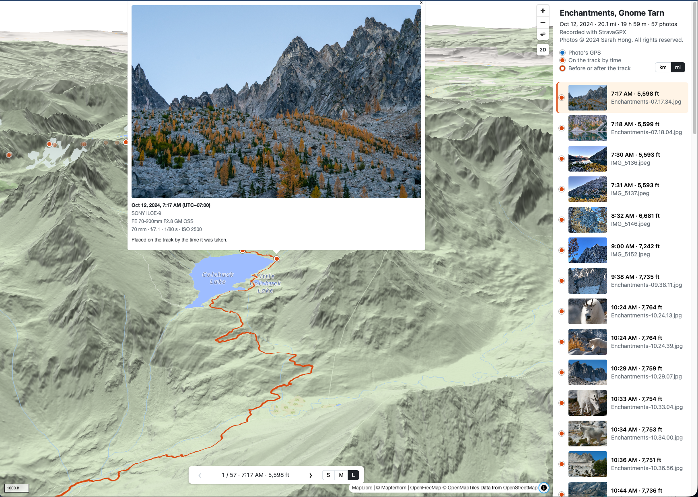
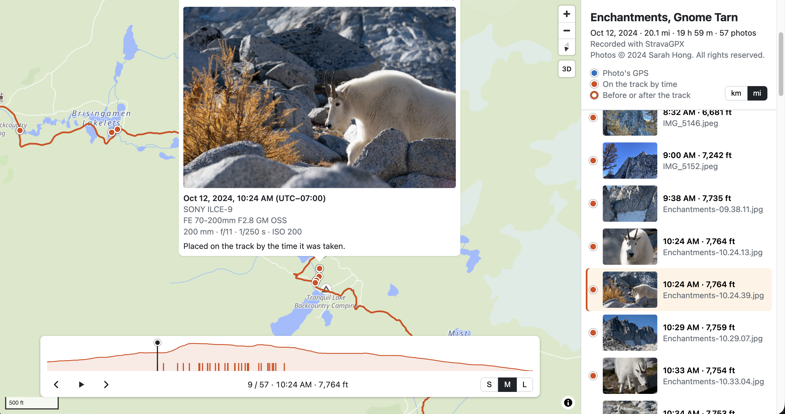
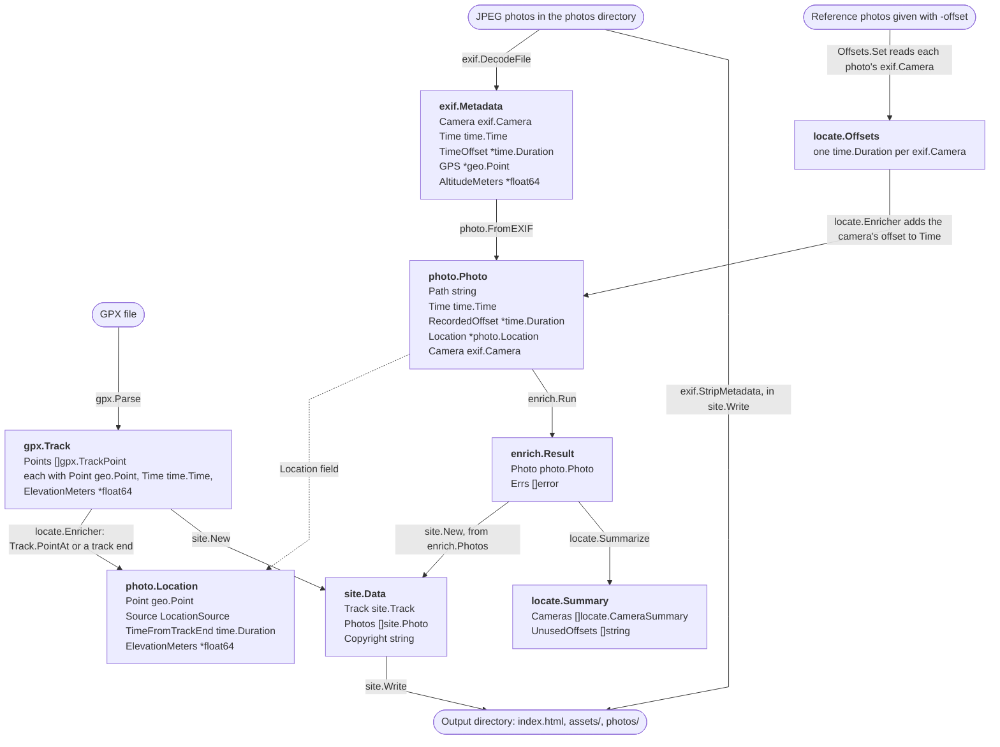

# retrace

Go tool that places hike photos along a GPX track, using each photo's EXIF GPS or its time on the track. Runs locally and builds a static web page showing the photos on an interactive 2D and 3D map, for revisiting or sharing viewpoints.

**Live example:** [The Enchantments](https://retrace-enchantments.shong88tx.workers.dev/), a page retrace generated from 57 photos and a Strava track. Try the 3D button and the arrow keys, as described in [The HTML page](#the-html-page). Ctrl-drag (or right-drag) tilts and turns the map.

## Motivation

**retrace** started as a way to combine two of my hobbies: photography and hiking. I love taking photos on the trail and editing them afterward, but I'd often lose track of exactly where a shot was taken. Without GPS enabled on my camera or phone, there was no record to go back to.

I do record my hikes on AllTrails, though. So I built retrace to map my photos back onto that GPX track, matching each photo's timestamp to my position on the trail at that moment. That way I can retrace my steps and revisit a spot, perhaps to try a different photo composition, catch different light, or come back in another season.

Right now it handles the core problem of mapping photo timestamps to trail positions. I'm planning to expand it with richer enrichment next, including nearby points of interest, weather and sunlight conditions at capture time.

## Install

Requires Go 1.27.1+.

```sh
go install github.com/sh531/retrace/cmd/retrace@latest
```

Or from a local clone:

```sh
git clone https://github.com/sh531/retrace.git
cd retrace
go install ./cmd/retrace
```

Both install `retrace` to `$(go env GOPATH)/bin` (usually `~/go/bin`), which needs to be on your `PATH`.

## Usage

### Retrace Command

retrace takes a directory of JPEG photos and a GPX track (with timestamps) recorded on the same hike. Export HEIC and RAW photos as JPEG first, since browsers can't display RAW and most can't display HEIC. retrace reads the files directly inside the photos directory, not its subdirectories.

```sh
# Phone photos: the clock sets itself, so no offset is needed
retrace -photos ~/Pictures/enchantments -gpx enchantments.gpx

# Camera photos, where the camera's clock is 2m30s behind the phone
retrace -photos ~/Pictures/enchantments -gpx enchantments.gpx \
  -offset ~/Pictures/enchantments/DSC00042.jpg=2m30s

# Phone and camera photos together, written to another directory
# (the offset applies only to the camera that took DSC00042.jpg)
retrace -photos ~/Pictures/enchantments -gpx enchantments.gpx \
  -offset ~/Pictures/enchantments/DSC00042.jpg=2m30s -output ~/Sites/enchantments

# List the flags
retrace -h
```

| Flag                     | Meaning                                                                                                                                                                                                 |
| ------------------------ | ------------------------------------------------------------------------------------------------------------------------------------------------------------------------------------------------------- |
| `-photos dir`            | Directory of JPEG photos from the hike (required).                                                                                                                                                      |
| `-gpx file`              | GPX track recorded during the hike (required).                                                                                                                                                          |
| `-offset photo=duration` | Corrects the clock of the camera that took `photo`, a path relative to the current directory. Repeatable, once per camera; see [Finding your camera's offset](#finding-your-cameras-offset) (optional). |
| `-output dir`            | Where to write the page, default `retrace-out`. It must not exist yet or be empty, so retrace never overwrites anything; delete it to run again.                                                        |
| `-photographer name`     | Adds a copyright notice to the page, e.g. "Photos © 2024 Sarah Hong. All rights reserved.", dated with the year the hike started (optional).                                                            |

retrace keeps going when a photo can't be read or located, and reports it. After the warnings, it prints one line per camera saying how its photos were timed and located, leaving out zero counts. It exits with 0 on success, 1 on an error, and 2 for a mistake in the command line.

```
level=WARN msg="no capture time or GPS in its EXIF, so it can't be located" photo=photos/scan.jpg
level=INFO msg=camera camera="Apple iPhone 13 Pro" total_photos=12 recorded_offsets=-07:00 located_by_exif=12
level=INFO msg=camera camera="SONY ILCE-9" total_photos=40 recorded_offsets=-07:00 applied_offset=2m30s located_by_track=38 located_at_track_end=2 max_time_from_track_end=18m28s
level=INFO msg=camera camera="none in EXIF" total_photos=1 unlocated=1
level=INFO msg=done photos=53 output=retrace-out
```

| Key                       | Meaning                                                                                             |
| ------------------------- | --------------------------------------------------------------------------------------------------- |
| `recorded_offsets`        | Timezones the camera recorded (`OffsetTimeOriginal`), used to convert its times to UTC.             |
| `assumed_utc`             | Photos with no recorded timezone, whose times were taken as UTC.                                    |
| `applied_offset`          | The `-offset` added to this camera's times.                                                         |
| `located_by_exif`         | Photos placed by their own EXIF GPS.                                                                |
| `located_by_track`        | Photos placed on the track by time.                                                                 |
| `located_at_track_end`    | Photos taken before the track started or after it ended, placed at its nearest end.                 |
| `max_time_from_track_end` | The furthest of those from the track, in time. Hours usually means the camera's `-offset` is wrong. |
| `unlocated`               | Photos with neither GPS nor a time, so they couldn't be placed.                                     |

### The HTML page

retrace writes a static site to the `-output` directory. Open its `index.html` in a browser, or upload the whole directory to a static host such as GitHub Pages. The map and its library load from the internet, so viewing the page needs a connection.

```
retrace-out/
├── index.html      # the page, with the track and photo data inlined
├── assets/         # the page's script and styles
└── photos/         # copies of the photos, without personal information
```

The page shows the trail on a map with a pin for each photo, and lists the photos by time beside it. Click a pin or a photo in the list to see the photo, when it was taken, the camera settings, and how its pin was placed. Filled pins were placed by the photo's GPS (blue) or on the track by time (orange); hollow pins are photos taken before or after the track, placed at its nearest end. Photos with neither GPS nor a time are listed under "Not on the map". With `-photographer`, the header shows a copyright notice for the photos; see [Design decisions](#the-html-page-1) for why it uses the hike's year.

Toggle between S, M, and L to set how large the photo is shown. The 3D button under the zoom buttons tilts the map over the mountains, and 2D flattens it again. Use the arrow keys or buttons on the bottom of the page to step through the photos in time order. Times are shown in the timezone the camera recorded, so they read as they did on the hike wherever the page is viewed. Distances and elevations are metric or imperial, chosen from the browser's language and switchable on the page. Ctrl-drag (or right-drag) tilts and turns the map.

Press ▶ (or Space) to fly along the trail: a marker follows the track, pausing at each photo, which shows with its details in a panel above the bar. The bar shows the elevation profile, with a tick for each photo; click or drag on it to jump along the track. Clicking a pin or a photo in the list, or pressing × or Esc, stops the flythrough. In 3D, the camera looks the way the hiker was walking.




### Finding your camera's offset

If the photos have no GPS, retrace places them on the track by time. It converts each photo's `DateTimeOriginal` to UTC using the timezone the camera recorded in `OffsetTimeOriginal`. If the camera recorded no timezone, retrace assumes the time is already UTC. The flag `-offset photo=duration` then adds a correction for the camera that took the `photo`, e.g. `-offset DSC00042.jpg=2m30s`: every photo with the same EXIF `Make` and `Model` as DSC00042.jpg gets 2m30s added. Use the clock photo from the steps below, or any other photo from that camera. Repeat the flag once per camera. If you don't add an offset for a camera, there will be no correction. Photos taken by a phone won't need an offset correction since their clocks set themselves.

How to determine the -offset duration:

1. With the camera, take a photo of your phone's clock.
2. Read the camera's time and timezone from that photo: `exiftool -DateTimeOriginal -OffsetTimeOriginal photo.jpg`.
3. Convert both times to UTC, then subtract:
  ```
   offset = phone time in UTC − camera time in UTC
  ```
   For the camera's time in UTC: if it recorded a timezone, convert using that timezone (`-07:00` means 7 hours behind UTC, so add 7 hours). If it recorded no timezone, retrace assumes the time is already UTC, so use it unchanged.
   For example, the phone shows 08:00:00 PDT, which is 15:00:00 UTC:

  | Camera recorded        | Camera time in UTC | phone time in UTC 15:00:00 − camera time in UTC       |
  | ---------------------- | ------------------ | ----------------------------------------------------- |
  | 07:57:30 with `-07:00` | 14:57:30           | `-offset photo.jpg=2m30s` (camera is behind phone)    |
  | 08:07:30, no timezone  | 08:07:30           | `-offset photo.jpg=6h52m30s`                          |
  | 08:01:15 with `-07:00` | 15:01:15           | `-offset photo.jpg=-1m15s` (camera is ahead of phone) |

   Shortcut: if the camera recorded the same timezone the phone shows, just subtract the two clock times: 08:00:00 − 07:57:30 = 2m30s.

The same offset works for every photo until you change or reset the camera's clock.

## How the data fits together

A few small types carry all of retrace's data. Packages share them instead of converting between their own versions, so a track point's position can become a photo's location as it is. Only `site` converts them, into the shapes the page reads.



Rounded boxes are retrace's inputs and its output, and the other boxes are structs. Each solid arrow is labelled with the function that writes the struct it points to; the dotted arrow is a field. How photos pass through the enrichers is described under [Enrichment](#enrichment).

- `geo.Point` (`Lat`, `Lon`) is the only coordinate type. Track points, EXIF GPS, and photo locations all use it, so `locate` copies a `gpx.TrackPoint`'s `Point` straight into a `photo.Location`.
- `time.Time` is always UTC. `exif` converts camera time when it reads it and `gpx` converts track time when it parses it, so `locate` compares a photo's `Time` with track times directly.
- `exif.Camera` (`Make`, `Model`) identifies a camera. It's a struct of two strings, so it can be compared with `==` and used as a map key: `locate.Offsets` stores one offset per `exif.Camera`, and `locate.Summarize` groups photos by it.
- `photo.Photo` is everything retrace knows about one photo. `photo.FromEXIF` builds it from `exif.Metadata`, renaming `TimeOffset` to `RecordedOffset` so it isn't mistaken for the `-offset` correction. Each enricher takes one and returns an updated copy. Unknown values stay empty instead of using a default that looks real: a zero `Time`, a `nil` `Location`.
- `photo.Location` (`Point`, `Source`, `TimeFromTrackEnd`, `ElevationMeters`) records where a photo was taken and how that was figured out: `exif`, `interpolated`, or `track_end`. `TimeFromTrackEnd` says how far a `track_end` photo was from the track. `ElevationMeters` comes from the same place as `Point`: EXIF `GPSAltitude`, or the track.
- `enrich.Result` pairs each finished `photo.Photo` with the errors from enrichers that failed on it, so one bad photo is reported without stopping the run.
- `site.Data` is what the page shows, built by `site.New` from the track and the enriched photos. Its types are separate from `photo.Photo` and `gpx.Track` because the JSON is a contract with the page's JavaScript: key names carry units (`elevation_meters`, `seconds_from_track_end`), and it leaves out what the page doesn't need. `site.Write` writes it into `index.html` and copies each photo through `exif.StripMetadata`.

## Design decisions

### Time

**Camera time is a fixed offset per device.**

- EXIF `DateTimeOriginal` has no timezone. Phones record theirs in `OffsetTimeOriginal`, and many cameras record the zone they were set to.
- A camera clock that is never adjusted doesn't follow travel or daylight saving, and it drifts.
- So retrace corrects each camera's times with one `-offset`, which covers both a wrong zone and drift; see [Finding your camera's offset](#finding-your-cameras-offset).

**A camera is identified by a photo it took, not by name.**

- `-offset DSC00042.jpg=2m30s` applies to every photo with exactly the same EXIF `Make` and `Model` as DSC00042.jpg. Typing a camera name instead would mean guessing which EXIF strings it stands for: makes can be company names (`NIKON CORPORATION`, `OLYMPUS CORPORATION`), models can repeat the make (`NIKON D850`) or differ from the marketing name (a Sony A9 reports `ILCE-9`).
- There's one offset per camera model (EXIF `Make` and `Model`), since each camera's clock drifts on its own. Two bodies of the same model look the same; telling them apart would mean also matching the EXIF `BodySerialNumber`, which retrace doesn't read: it's a rare case, and exported photos often leave the serial out.
- A reference photo with neither `Make` nor `Model` is rejected, since it would match every photo with stripped metadata, from any camera.
- retrace reports reference photos whose camera took none of the photos, which usually means the wrong file was given.

**Times are stored in UTC.**

- The recorded offset is only used to work out UTC, so JSON times always end in `Z`.
- `==` on `time.Time` compares the zone as well as the instant, so with one zone a stray `==` can't give a wrong answer.
- An unknown time is the zero `time.Time`, not a `nil` pointer, following Go convention: year 1 is never a real photo time.

### Location

**A photo's location is optional and all-or-nothing.**

- `Photo.Location` is a `*Location` holding the point and how it was determined (`exif`, `interpolated`, or `track_end`), or `nil` when the photo couldn't be located.
- Grouping them means a point can't exist without a source, or vice versa.
- `nil` keeps the zero value (0,0), a real place in the Atlantic, from being plotted by mistake.

**EXIF GPS first, then the track.**

- A photo with EXIF GPS keeps it, since the camera's own fix is more accurate than a position worked out from its clock. Otherwise retrace interpolates along the track: it finds the track points recorded just before and after the photo's corrected time and places the photo the same fraction of the way between them, in a straight line. Points are usually a few seconds apart (about 3 s in an AllTrails track, 1 s in a Strava one), so the straight line between two of them stays close to the trail.
- A photo taken before the track starts or after it ends is placed at the track's nearest end, with source `track_end` and the time between the photo and that point (`TimeFromTrackEnd`), negative before the start and positive after the end. A recording often stops before the photos do (stopped early, or the phone died), and the end of the track is the best guess. The map shows these pins hollow and says how far off they are. retrace reports how many per camera and the longest gap, since many photos at the ends, hours away, means the camera's `-offset` is wrong.
- A gap inside the track (e.g. the recording paused during a break) is bridged with a straight line, so photos taken during it may be placed off the trail.
- A photo with no time stays unlocated: adding the `-offset` to a zero time would turn "unknown" into a fake time.
- A photo's elevation comes from the same place as its position: EXIF `GPSAltitude` for a photo with GPS, the track interpolated by time, or the track end's. It is unknown, not 0 m, when that source has none.

**Some GPS values mean "no fix".**

- A position with `GPSStatus` V ("void") or at exactly (0,0) is treated as missing.
- (0,0) is a real place, but no hike goes there, and some devices write zeros when they have no fix.

### GPX tracks

**Track points need a time; elevation is optional.**

- Time is what places a photo on the track, so a point without `<time>` fails parsing. The usual cause is exporting a trail's planned route instead of a recorded activity.
- Elevation is `*float64` and `nil` when `<ele>` is missing, because 0 m is sea level: a zero default would look like a real reading. NaN isn't used because `encoding/json` can't encode it.

### Photos and EXIF

**JPEG only.**

- The page has to display the photos, and browsers can't show RAW and mostly can't show HEIC, so they have to be exported as JPEG anyway.
- HEIC wraps the same TIFF-format EXIF block, so supporting it later means finding that block in a different container.

**A hand-written EXIF reader.**

- `internal/exif` reads just the [tags](https://exiftool.org/TagNames/EXIF.html) retrace uses, with the standard library (`encoding/binary`).
- Considered: [rwcarlsen/goexif](https://github.com/rwcarlsen/goexif) (last commit April 2019), [dsoprea/go-exif](https://github.com/dsoprea/go-exif) (last commit August 2023), and [evanoberholster/imagemeta](https://github.com/evanoberholster/imagemeta), which is maintained but brings 7 direct dependencies and support for RAW and HEIC formats retrace doesn't accept. exiftool was ruled out as a runtime dependency because it's an extra install for every user.
- retrace needs 19 tags from JPEG files, a few hundred lines of standard-library code that can be fuzzed and fully tested, which is less to audit than a dependency tree.
- The reader checks every offset against the data before following it, and a fuzz test (`FuzzDecode`) checks that malformed files never cause a panic or out-of-range values.
- How EXIF is laid out inside a JPEG (segments, the TIFF header, image file directories) is explained in the package docs: [`internal/exif/doc.go`](internal/exif/doc.go), or run `go doc ./internal/exif`.
- exiftool is only used to regenerate the test fixtures, as an independent EXIF writer to check the reader against. Running retrace or its tests doesn't need it.

### Enrichment

**Each photo passes through a list of enrichers; photos are processed in parallel.**

- An enricher (`enrich.Enricher`) takes a photo and returns an updated copy: reading EXIF first, then location. They run in order for each photo, since locating needs the time EXIF provides.
- One enricher failing doesn't stop the others: its result is discarded, the error is kept with the photo, and the next enricher gets the photo unchanged. So a photo with malformed EXIF is kept, unlocated, with a warning: one bad photo out of 500 shouldn't ruin the run, though a bad GPX file still does.
- Enrichers take and return a photo value rather than a pointer. If an enricher fails, its returned photo is ignored and the next enricher gets the photo from before. That's only safe if the failed enricher changed nothing but its own copy, and the copy is shallow: pointer fields such as `Location` point at the same data in both the original and returned photos. So enrichers must assign new values to those fields instead of modifying them.
- Concurrency uses [errgroup](https://pkg.go.dev/golang.org/x/sync/errgroup) from the Go team's `golang.org/x/sync`, whose `SetLimit` caps how many photos are processed at once. Each goroutine writes only its own element of the results slice, so no mutex or channel is needed and results stay in input order.
- No lock is needed because nothing is shared: the Go [memory model](https://go.dev/ref/mem) only calls it a data race when goroutines access the same memory location, and each goroutine writes a different element. Reading the results after `Wait` is safe because a `sync.WaitGroup`'s `Done` "synchronizes before" `Wait` returns. This is the pattern in errgroup's own `ExampleGroup_parallel`. The tests run `Run` with several workers under `go test -race`, which reports any unsafe write.
- Only cancelling (Ctrl-C) stops a run. Enricher errors never cancel it, so the group is created without `errgroup.WithContext`.
- It isn't a channel pipeline in the sense of the Go blog's [Pipelines and cancellation](https://go.dev/blog/pipelines) (stages of goroutines connected by channels): enrichers are plain function calls inside one goroutine per photo, since only reading EXIF is slow per photo. Splitting them into stages would add channels to close and cancel without making anything faster.

### The HTML page

**Published photos keep only what a browser needs to display them.**

- The output directory is meant to be uploaded, and photos carry personal information: GPS position, camera serial number, capture time, edit history, and sometimes a second copy of the image or a motion photo's video.
- `exif.StripMetadata` copies each photo's image data as it is, without re-encoding, and keeps only the segments a browser needs: the colour profile (ICC), the JFIF and Adobe segments that tell the decoder how colours are encoded, and, when the photo isn't upright, EXIF `Orientation`, rewritten as an EXIF block holding only that tag.
- Listing what to keep, rather than what to remove, also drops metadata retrace doesn't know about, see exiftool's [JPEG tag list](https://exiftool.org/TagNames/JPEG.html). Anything after the end of the image, such as an Android motion photo's video or an iPhone's HDR gain map, is dropped too.
- A photo that can't be read or stripped is left off the page with a warning. Originals are never copied.

**The copyright notice uses the hike's year.**

- A notice is optional for works created after March 1, 1989, but the U.S. Copyright Office notes legal benefits to including one. It has three parts: ©, the year of first publication, and the owner's name ([Circular 3](https://www.copyright.gov/circs/circ03.pdf)).
- retrace can't know when photos were first published, since they may have been posted elsewhere. It uses the year the track starts, which is never later, and doesn't change when the page is regenerated.
- The notice covers the photos only. The page's code is retrace's, under its own license.

**The data is inlined in the page.**

- `fetch` fails for a page opened from a file, so `index.html` carries the data in a `<script type="application/json">` element, and no separate data file is written.
- `json.Marshal` escapes `<`, `>`, and `&` (`\u003c`), so a track name containing `</script>` can't end the element early. It also reports encoding errors, which `html/template`'s own escaping would write into the page instead.
- The page's template, script, and styles are embedded in the binary with `go:embed`. The script is a classic script, not a module, since browsers block module scripts in a page opened from a file.

**MapLibre GL JS and OpenFreeMap tiles.**

- Neither needs an API key or an account.
- MapLibre is loaded from jsDelivr with a pinned version (version 5) and a [Subresource Integrity](https://developer.mozilla.org/en-US/docs/Web/Security/Subresource_Integrity) hash, so the browser won't run a changed file. The tiles need a connection anyway, so bundling the 1 MB library wouldn't make the page work offline.

**3D terrain is optional.**

- The 3D button draws the map over [Mapterhorn](https://mapterhorn.com)'s open elevation tiles, which need no API key, with hillshading. Compared with AWS Terrain Tiles, the other keyless source, its mountains are sharper.
- Terrain costs about 5 MB per new view, so the page starts in 2D and downloads none until 3D is chosen; the choice is remembered.
- In 3D, choosing a photo points the camera the way the hiker was walking, measured from the track 100 m before the photo. Facing north, ridges hid pins in the Colchuck Lake basin.

**Pins are drawn by the map, not as page elements.**

- MapLibre's markers are HTML elements placed over the map. In 3D, each one checks on every camera move whether terrain hides it, by reading a pixel back from the GPU, which makes the browser wait for the GPU to finish drawing.
- With the example's 57 pins, moving the camera over terrain ran at about 21 frames a second. Drawn as circle layers, which the map renders with everything else, it ran at about 56, measured back to back in the same browser.

**The drawn track is smoothed; the data isn't.**

- A GPS reading is off by a few metres, about as far as a hiker moves between points recorded every second. Drawn as recorded, the example Strava track of the Enchantments zigzags, knots up wherever the hiker stood still, and measures 29.1 mi.
- The page averages each point with its neighbours within 5 seconds, then keeps a point only once it is 2 m from the last one kept. The line follows the trail's curves, most knots disappear, and the photos' pins stay within about a metre of it. The track then measures 20.1 mi, and the page shows the length of the line it draws.
- Thinning more removes the last knots but pulls the line away from the pins, since hikers stand still where they take photos: at 3 m some pins were 2.7 m off the line.
- The page's data keeps every recorded point, and photos are placed on the recorded track, so only the drawing and the distance change.

## Project structure

The layout follows the Go team's [Organizing a Go module](https://go.dev/doc/modules/layout) guide. The module contains a [command with supporting packages](https://go.dev/doc/modules/layout#package-or-command-with-supporting-packages), with the command in `cmd/retrace/` and its supporting packages in `internal/`.

```
retrace/
├── cmd/
│   └── retrace/
│       ├── main.go              # CLI entrypoint (package main): flags and the run
│       └── report.go            # warnings and a summary line per camera
├── docs/
│   └── images/                  # screenshots for this README
├── internal/                    # supporting packages, importable only within this module
│   ├── enrich/                  # runs enrichers over photos concurrently
│   ├── exif/                    # JPEG EXIF reader and metadata stripping (standard library only)
│   │   └── testdata/gen.sh      # regenerates the synthetic fixture JPEGs (needs exiftool)
│   ├── geo/                     # coordinates and their limits
│   ├── gpx/                     # GPX track parser, position at a time
│   ├── locate/                  # per-camera clock offsets, locating photos on the track
│   ├── photo/                   # Photo type, listing a photo directory, EXIF enricher
│   └── site/                    # output directory: page data, photos without personal information
│       └── web/                 # the page's HTML template, script, and styles, embedded with go:embed
├── .devcontainer/
│   ├── devcontainer.json        # dev container: Go, Git hooks, editor extensions
│   ├── devcontainer-lock.json   # pinned dev container feature versions
│   ├── Dockerfile               # base image + exiftool + golangci-lint
│   └── Dockerfile.dockerignore  # limits the build context to files the Dockerfile copies
├── .githooks/
│   └── pre-commit               # tidy, gofmt, vet, and lint before each commit
├── .github/
│   └── workflows/
│       └── ci.yml               # tidy, gofmt, vet, test -race, build, and lint on push/PR
├── .gitignore
├── .golangci-lint-version       # pinned golangci-lint version (Makefile, CI, dev container)
├── .golangci.yml                # linter configuration
├── go.mod
├── go.sum                       # dependency checksums
├── LICENSE
├── Makefile                     # check, build, test, and lint targets
└── README.md
```

## Development

### Dev container (recommended)

The repo includes a dev container with Go 1.27.1 and the Git hooks pre-configured.

- **VS Code / Cursor:** install the Dev Containers extension (in Cursor: `@id:anysphere.remote-containers`), then run **Dev Containers: Reopen in Container**. Requires Docker.
- **Terminal only** (requires Docker and Node):
  ```sh
  npx --yes @devcontainers/cli up --workspace-folder .
  npx --yes @devcontainers/cli exec --workspace-folder . bash
  ```

### Local

Requires Go 1.27.1+ and golangci-lint (version in `.golangci-lint-version`, [install docs](https://golangci-lint.run/docs/welcome/install/local/)). Point Git at the shared hooks so tidy, gofmt, vet, and lint checks run before each commit:

```sh
git config core.hooksPath .githooks
```

### Build and test

```sh
make check              # everything CI runs
make build              # build to bin/retrace
go run ./cmd/retrace    # run without installing
```
